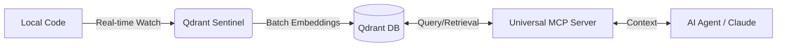

# Qdrant Sentinel 🛰️

## Do I need this? What for?

If you are working with **AI agents** (like Claude, ChatGPT, or Antigravity) and you want them to have a **deep, always up-to-date understanding of your codebase**, you need this.

Manually feeding files to an LLM is tedious and slow. **Qdrant Sentinel** automates this by:
1.  **Watching** your project folders in real-time.
2.  **Indexing** every line of code into a [Qdrant](https://qdrant.tech/) vector database.
3.  **Syncing** only what changed, so your "AI brain" always has the latest context.

### 🔄 Data Flow


---

## ⚡ Quick Start

1. **Clone & Install**: `git clone ... && uv sync`
2. **Configure**: Copy `.env.example` to `.env` & `projects.json.example` to `projects.json`.
3. **Run**: `pm2 start ecosystem.config.js` (or `uv run qdrant-sentinel`)

---

## 🤝 Better Together (Production-Grade RAG)

While **Qdrant Sentinel** handles the _indexing_ (getting data in), it works best when paired with the **[Qdrant Universal MCP Server](https://github.com/neco001/qdrant2.git)**.

### Why this architecture?
Unlike monolithic MCP servers that try to index code on-the-fly (and stall your LLM interface), this **split architecture** ensures:
- **Index is always ready**: Sentinel runs as a background daemon.
- **Low Overhead**: The AI only queries what it needs via the MCP tool.
- **Stability**: Large scans don't crash your Claude Desktop session.

| Feature | Standard MCP Indexers | Qdrant Sentinel + Universal MCP |
| :--- | :---: | :---: |
| **Indexing Mode** | On-demand (stalls UI) | **Background Daemon** (Always-on) |
| **Multi-project** | Often single-folder | **Unlimited projects** via config |
| **Vector Integrity** | Basic (may pad vectors) | **Strict dimension enforcement** |
| **Model Support** | Often OpenAI only | **Universal Proxy** (DashScope, Ollama, etc.) |

---

## 🛠️ Prerequisites: Set Up Qdrant

Before running the Sentinel, you need a running Qdrant instance.

### Option A: Local Setup (Docker) - Recommended
```bash
docker run -d --name qdrant -p 6333:6333 -v qdrant_data:/qdrant/storage qdrant/qdrant
```

### Option B: Qdrant Cloud
Sign up at [Qdrant Cloud](https://cloud.qdrant.io/) and get your Cluster URL and API Key.

---

## ✨ Features

- **Real-time Monitoring**: Uses `watchdog` to detect file changes and instantly update the index.
- **Multi-project Support**: Index multiple independent repositories into separate Qdrant collections.
- **Intelligent Filtering**: Respects `.gitignore`, `.git/info/exclude`, and `.rooignore`.
- **State Persistence**: Tracks file hashes in a local SQLite database to avoid redundant indexing.
- **Flexible Embeddings**: Compatible with any OpenAI-style embedding API.

## 🚀 Installation

This project uses [uv](https://github.com/astral-sh/uv) for dependency management.

1. **Clone & Setup:**
   ```bash
   git clone https://github.com/neco001/Qdrant_Sentinel.git
   cd Qdrant_Sentinel
   uv sync
   ```

2. **Configuration:**
   - Copy `.env.example` to `.env` and fill in your API keys.
   - Copy `projects.json.example` to `projects.json` and add your project paths.

## 🏃 Usage

### Manual Execution
```bash
uv run qdrant-sentinel
```

### Background Service (PM2)
```bash
pm2 start ecosystem.config.js
```

## 📄 License

MIT License. See `LICENSE` for details.

---
_Miłego dnia 😀_
